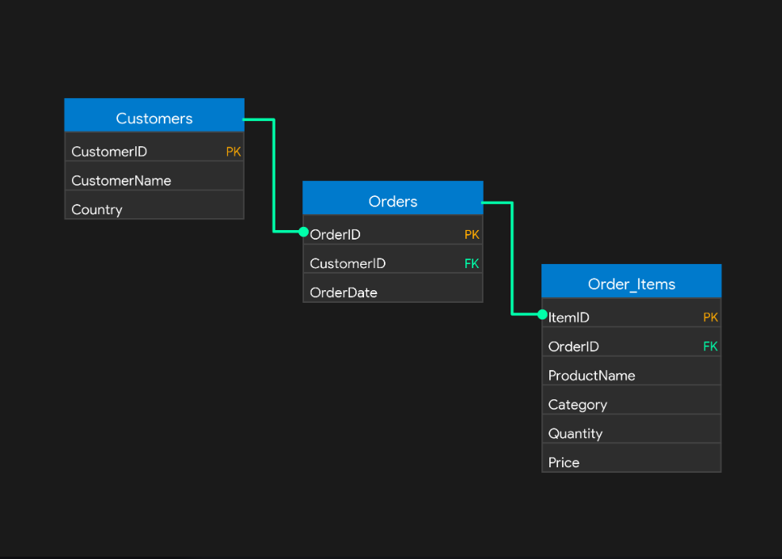

# Database Programming - Advanced SQL Project (Assignment I)

## 1. Business Problem

An E-Commerce Platform generates a large amount of customer, order, and product data every day. Business managers need advanced SQL techniques to analyze sales performance, customer purchasing behavior, product rankings, and revenue trends for better business decision-making.

---

## 2. Oracle Environment

- **Oracle Version:** Oracle Database 19c Enterprise Edition
- **Operating System:** Windows / Linux
- **Tools Used:** Oracle SQL Developer, SQL*Plus, GitHub

---

## 3. Database Schema

This project uses three related tables:

- **Customers**
- **Orders**
- **Order_Items**

### Relationships

- One customer can have many orders.
- One order can contain many products.
- Primary Keys and Foreign Keys are implemented to maintain referential integrity.

---

## 4. ER Diagram

---

## 5. Common Table Expressions (CTEs)

### 1. Simple CTE
Filters employee records using a Common Table Expression for simplified data retrieval.

### 2. Multiple CTEs
Uses multiple CTEs to divide a complex query into smaller logical parts before calculating business results.

### 3. Recursive CTE
Generates recursive records to demonstrate hierarchical and sequential processing.

### 4. CTE with Aggregation
Calculates total and average sales using aggregate functions inside a CTE.

### 5. CTE with JOIN
Combines customer information with order records using JOIN operations inside a CTE.

---

## 6. SQL Window Functions

### Ranking Functions

- ROW_NUMBER()
- RANK()
- DENSE_RANK()
- PERCENT_RANK()

Used to rank products and customers according to different business criteria.

### Aggregate Window Functions

- SUM() OVER()
- AVG() OVER()
- MIN() OVER()
- MAX() OVER()

Used to perform running totals and analytical calculations without grouping rows.

### Navigation Functions

- LAG()
- LEAD()

Used to compare previous and next values for business trend analysis.

### Distribution Functions

- NTILE()
- CUME_DIST()

Used to divide records into groups and analyze data distribution.

---

## 7. Analysis and Findings

### Descriptive Analysis

The database provides detailed information about customers, orders, products, and sales activities.

### Diagnostic Analysis

The analysis identifies top customers, product performance, sales rankings, and revenue distribution using CTEs and Window Functions.

### Prescriptive Analysis

The company should focus on high-value customers, improve low-performing products, optimize pricing strategies, and monitor sales trends using analytical SQL reports.

---

## 8. Challenges and Solutions

### Challenge

Managing complex SQL queries while maintaining readability and performance.

### Solution

Using Common Table Expressions (CTEs) to simplify query logic and Window Functions for efficient analytical reporting.

---

## 9. Lessons Learned

- Improved understanding of advanced SQL programming.
- Learned practical implementation of CTEs.
- Gained experience using SQL Window Functions.
- Improved database analysis and reporting skills.
- Learned professional project documentation using GitHub.

---

## 10. References

1. Oracle Corporation. Oracle Database SQL Language Reference.
   https://docs.oracle.com/en/database/oracle/oracle-database/

2. Oracle Corporation. Oracle Database SQL Language Reference - Analytic Functions.
   https://docs.oracle.com/en/database/oracle/oracle-database/

3. GitHub Documentation.
   https://docs.github.com/

---

## 11. Academic Integrity Statement

I confirm that this assignment is my own original work. All SQL scripts, database design, documentation, and analysis were completed independently. Any external resources used have been properly acknowledged in accordance with university academic integrity policies.
